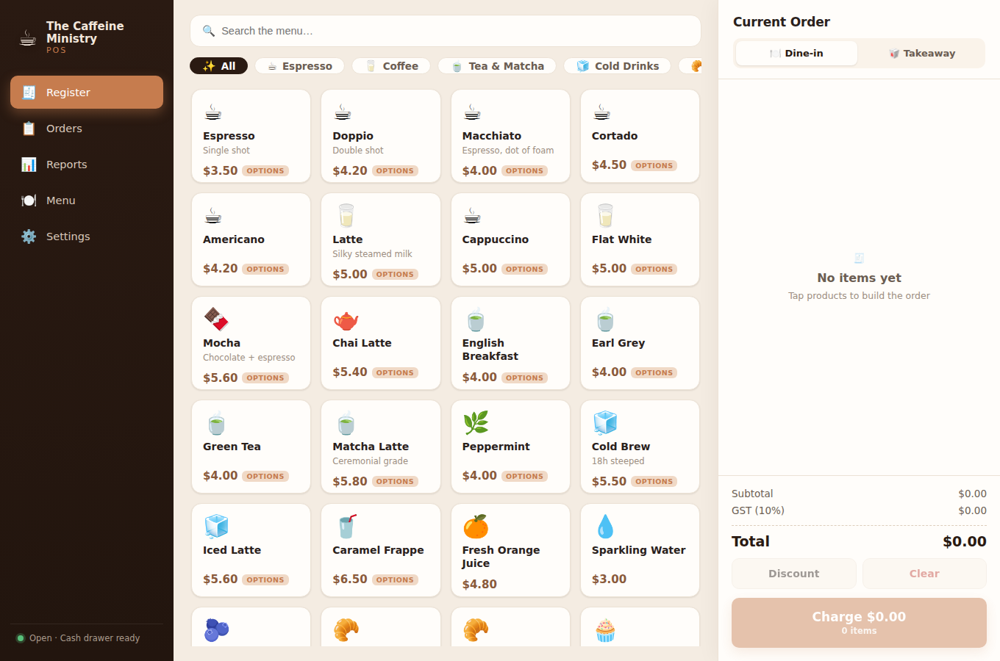

# ☕ The Caffeine Ministry — POS

A fully functional, touch-friendly **Point of Sale** system for The Caffeine
Ministry coffee shop. Built as a fast single-page app that runs entirely in the
browser — no backend or accounts required. All data (menu, orders, settings)
persists locally via `localStorage`.



## Features

### 🧾 Register
- Product catalog organised by category with instant search
- Item **modifiers** — size, milk, extra shots, syrups — with live price deltas
- Per-line quantities, notes, and automatic merging of identical items
- **Discounts** (percentage or fixed amount)
- **Dine-in / Takeaway** service type
- Automatic subtotal, tax, and total calculation

### 💳 Checkout
- **Cash** payments with an on-screen keypad, quick-tender buttons, and live
  change calculation
- **Card** payments
- Change is never negative and cash tenders below the total are blocked

### 🧾 Receipts
- Branded, itemised receipt with modifiers, notes, payment, and change
- One-tap **printing** via a dedicated print stylesheet

### 📋 Orders
- Full order history with **Today / All time / Refunded** filters
- Search by order number or item
- View any past receipt and issue **refunds**

### 📊 Reports
- KPI tiles: revenue, order count, average order value, items sold
- Revenue over the last 7 days, sales by category, top sellers, and a
  payment / service-type mix
- Time-range filter (Today / 7 days / 30 days / All)

### 🍽️ Menu Manager
- Create, edit, delete, and toggle availability of products
- Assign categories and modifier groups
- Reset to the default menu at any time

### ⚙️ Settings
- Store profile (name, tagline, address, phone, cashier)
- Currency symbol, tax label, and tax rate
- Danger zone: clear order history, reset menu, reset settings

## Tech stack

| | |
|---|---|
| Framework | React 18 + TypeScript |
| Build tool | Vite 6 |
| State | Zustand (with `localStorage` persistence) |
| Routing | React Router (hash routing, works from any host or `file://`) |
| Styling | Hand-written CSS (no UI framework) |

## Getting started

```bash
npm install      # install dependencies
npm run dev      # start the dev server (http://localhost:5173)
npm run build    # type-check and build to dist/
npm run preview  # preview the production build
```

## Project structure

```
src/
├── components/     # Reusable UI (Cart, ModifierModal, PaymentModal, Receipt…)
├── pages/          # Register, Orders, Reports, MenuManager, Settings
├── store/          # Zustand stores (menu, cart, orders, settings)
├── data/seed.ts    # Default menu, modifiers & store settings
├── utils/          # Money/line math, date formatting, id generation
├── types.ts        # Domain models
├── App.tsx         # Routes + layout
└── main.tsx        # Entry point
```

## Data & persistence

The app keeps three independent `localStorage` keys:

- `tcm-menu` — categories, products, modifier groups
- `tcm-orders` — recorded orders and the running order number
- `tcm-settings` — store profile and tax configuration

The cart itself is intentionally **not** persisted — a page refresh starts a
clean order, matching how a register behaves between customers. Clearing your
browser storage restores the default Caffeine Ministry menu on next load.
