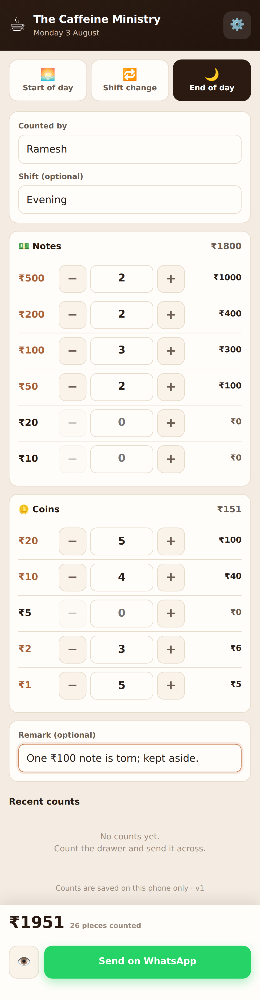

# 🧮 Cash Counter

A small phone app for counting the cash drawer at the **start of day**, at
every **shift change** and at the **end of day**. Staff enter how many of each
note and coin they hold, the app adds it up, and one tap sends the full
breakdown to the owner on WhatsApp — **+91 98292 22536**.



It is a standalone app. It does not read from, write to, or depend on the POS
in this repository — it is a separate page with its own storage that happens
to live in the same repo.

## Using it

1. Pick **Start of day**, **Shift change** or **End of day**
2. Type your name (it is remembered next time)
3. Enter the quantity for each denomination — type a number, or use the
   **−** / **+** buttons
4. Add a remark if the owner should know something
5. Tap **Send on WhatsApp** — WhatsApp opens with the message ready; tap send

The 👁 button shows the exact message first, and can copy it to the clipboard.

## What the owner receives

```
☕ *The Caffeine Ministry*
🧮 *CASH COUNT · END OF DAY* 🌙
━━━━━━━━━━━━━━━━━━
🗓 Mon, 03 Aug, 2026, 10:45 pm
👤 Counted by: Ramesh
🔁 Shift: Evening

💵 *NOTES*
₹500 × 2 = ₹1000
₹200 × 2 = ₹400
₹100 × 3 = ₹300
₹50 × 2 = ₹100
Notes subtotal: *₹1800*

🪙 *COINS*
₹20 × 5 = ₹100
₹10 × 4 = ₹40
₹2 × 3 = ₹6
₹1 × 5 = ₹5
Coins subtotal: *₹151*

━━━━━━━━━━━━━━━━━━
💰 *TOTAL CASH: ₹1951*
━━━━━━━━━━━━━━━━━━
26 notes & coins counted

📝 Remark: One ₹100 note is torn; kept aside.
```

## Installing it on a phone

Host the four files (`index.html`, `manifest.webmanifest`, `sw.js`,
`icon.svg`) on any static web host — GitHub Pages, Firebase Hosting, Netlify —
then open the link on the phone and choose **Add to Home screen**. It installs
as a normal app icon, opens without browser chrome, and works offline: a
service worker caches the app, so a count can be entered with no signal. Only
the final WhatsApp hand-off needs a connection.

To try it locally:

```bash
cd cash-counter
python3 -m http.server 4180     # then open http://localhost:4180
```

Opening `index.html` straight off the filesystem also works, minus the
offline caching (service workers need `http://` or `https://`).

## Settings & storage

The owner's number is built in as `+919829222536`. The ⚙️ button on the phone
can change the number and the shop name if they ever need to; those, the last
staff name, and the last 30 counts are kept in `localStorage` under
`tcm-cash-counter` — **on that phone only**. There is no server and no account,
so clearing the browser data clears the history.

Denominations are the Indian set — ₹500, ₹200, ₹100, ₹50, ₹20 and ₹10 notes,
and ₹20, ₹10, ₹5, ₹2 and ₹1 coins. Change the `DENOMS` list near the top of
the script in `index.html` for a different currency.

## How the WhatsApp send works

The app opens a `https://wa.me/<number>?text=<message>` link, which hands the
pre-written message to WhatsApp on the phone; the staff member taps send. That
means it needs no server, no API keys and no WhatsApp Business account — but
it is **not** an unattended send. Delivering without anyone tapping send would
need the WhatsApp Business API and a backend to call it.
